
<h1 align="center">网红酒店预定系统的设计与实现</h1>

## 简介
网红酒店预定系统：分为管理员和用户角色；具备客户信息管理、客房预订与退订、在线客服、公告发布等功能，用户可通过平台进行房间预订、信息管理及订单管理。    --计算机毕业设计源码；毕设源码；java毕业设计源码

## 联系方式

<h3 align="center">获取完整代码与数据库文件 + 微信：deepguan QQ: 86050149 QQ群: 783742310</h3>

<h3 align="center">可帮忙远程部署 包运行成功！提供远程部署、修改代码、设计文档指导、代码讲解等服务！</h3>

## 功能介绍（完整见运行截图）
管理员：基本功能包括登录和退出。首页提供系统概览和管理导航，用于访问客户管理、客房信息和订单管理模块。管理员可以管理客房信息，更新房间类型、图片、价格和设施等；处理预订和退订请求，审核订单状态并更新用户信息。系统管理功能支持用户数据的全面管理，以及对公告信息的编辑和发布，确保平台的顺利运营。

用户：基本功能涵盖注册、登录及退出操作。通过首页导航访问各种模块，包括查看酒店和房型信息、在线预订和管理个人资料。用户可以在客房信息页面查看房间详情、价格及预订状态，使用检索功能筛选合适的酒店房间。个人中心支持个人信息的修改、订单管理以及收藏的管理，用户可以查看预订历史和修改个人信息，提升用户操作的便捷性和体验。

## 运行截图
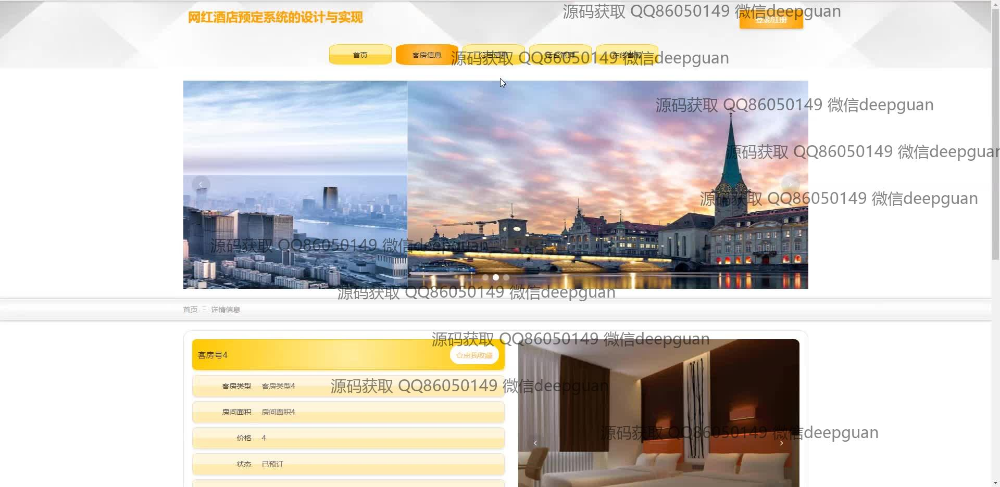
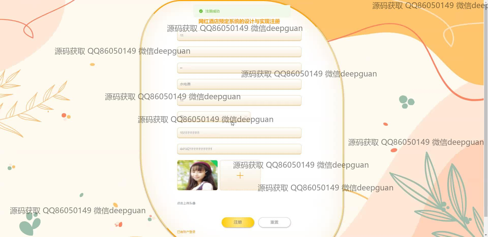
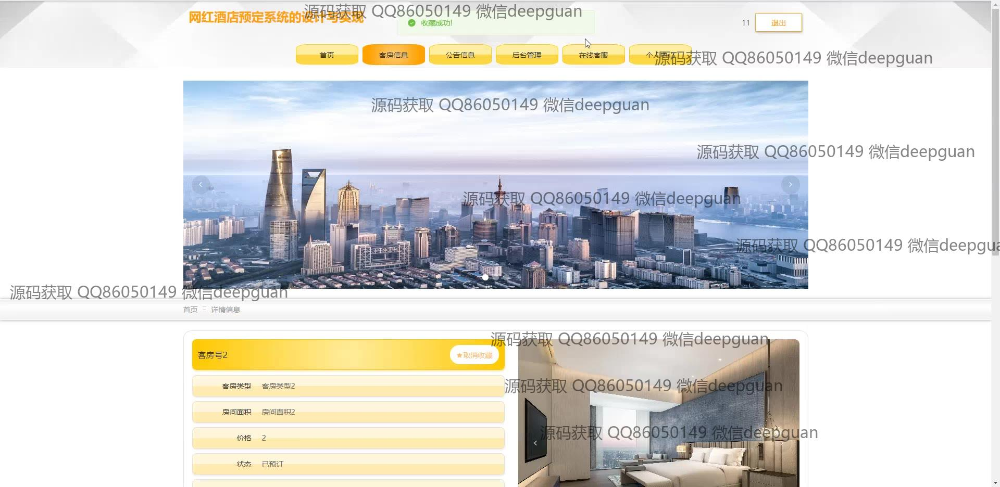
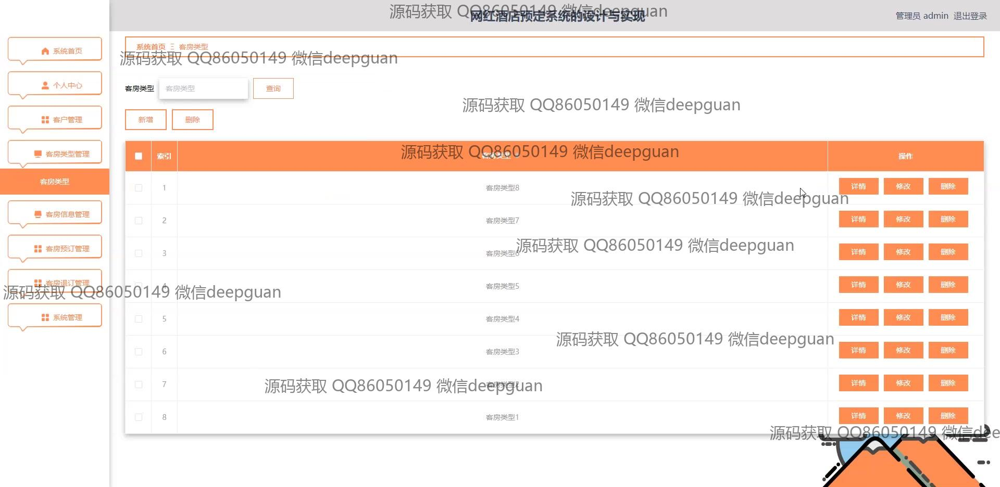
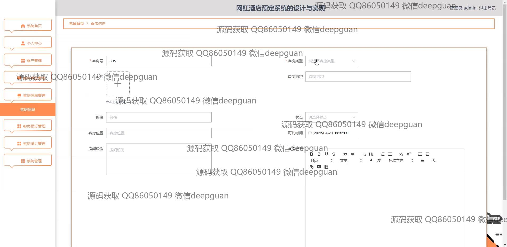

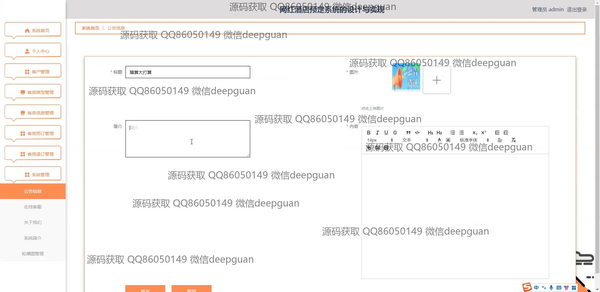
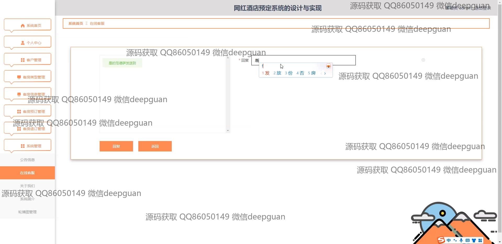
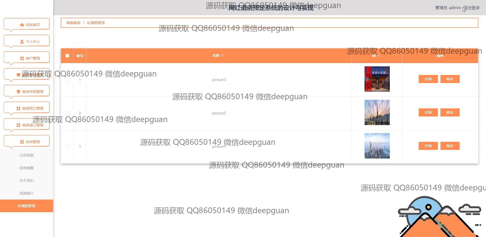

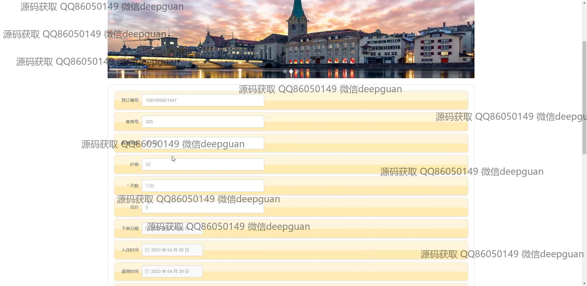
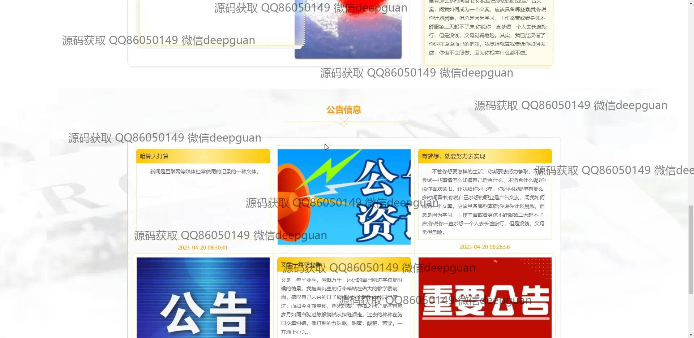
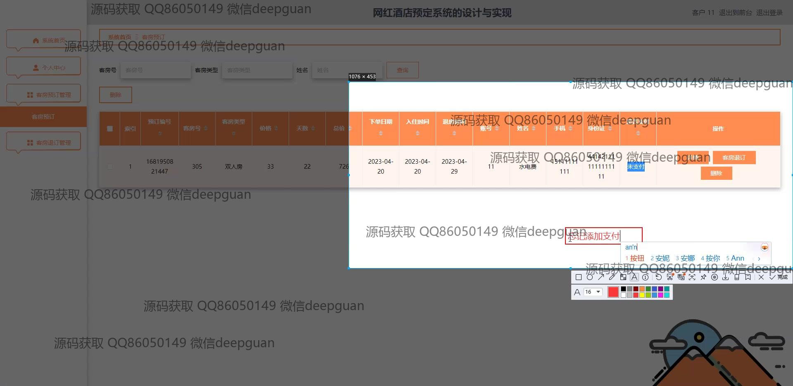

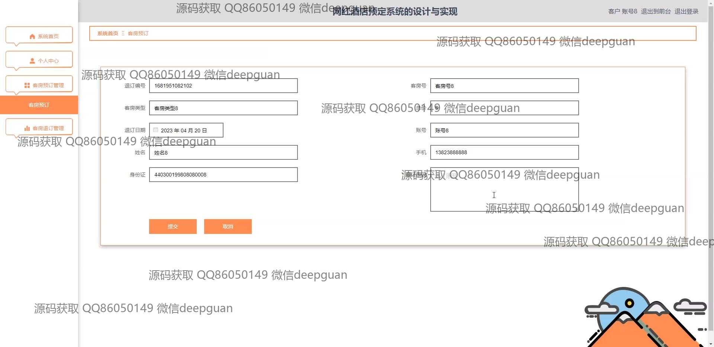
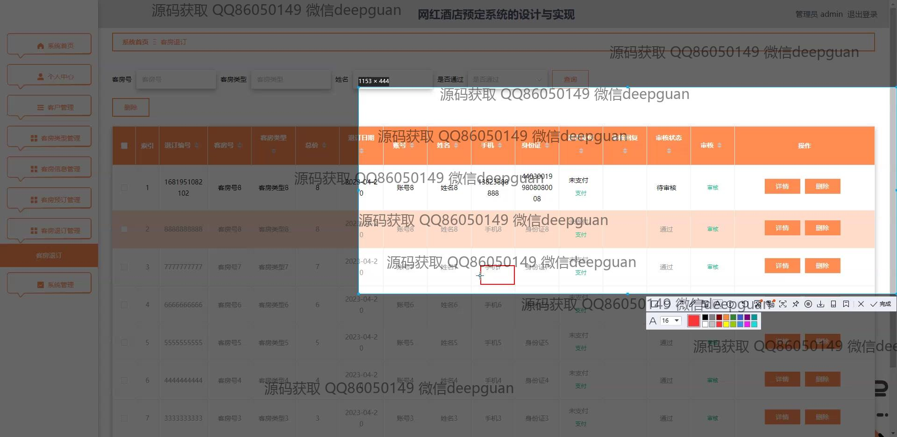

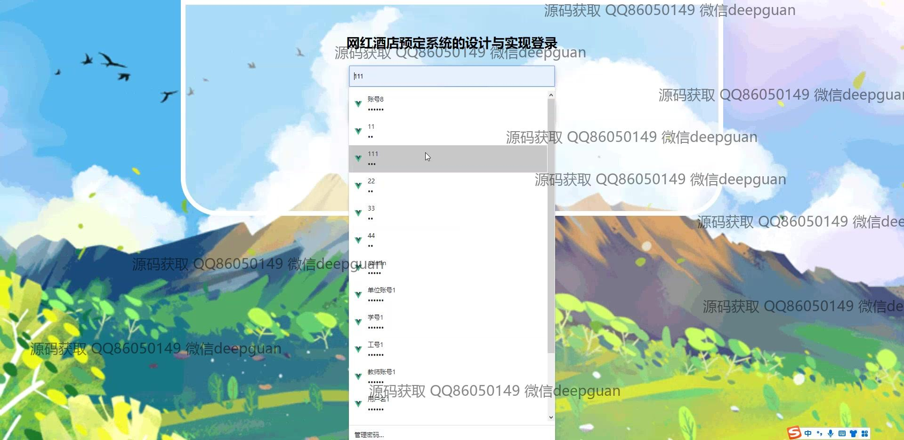
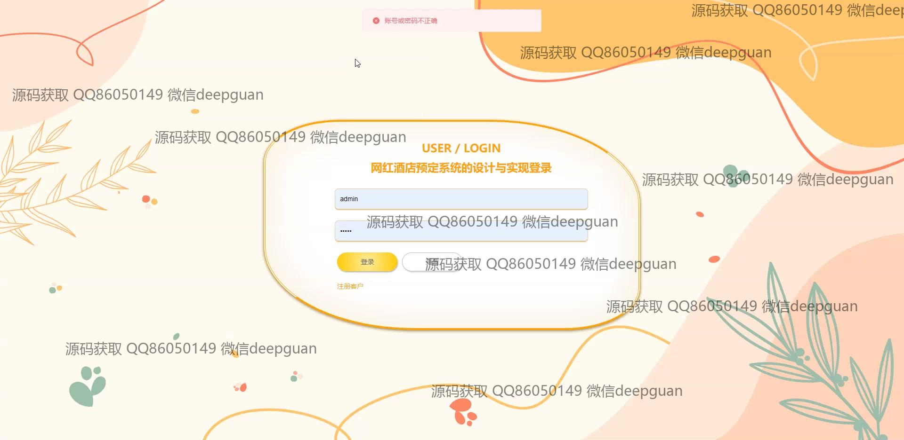
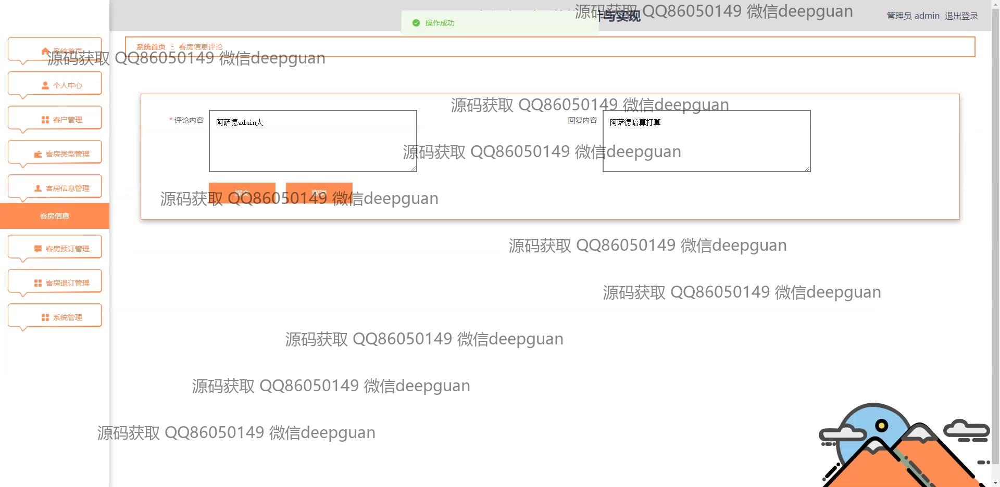
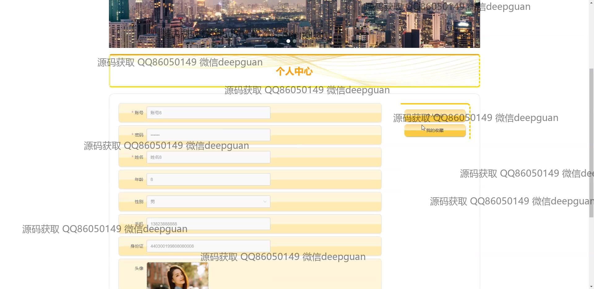

本代码来源于网络,仅供学习参考使用!

